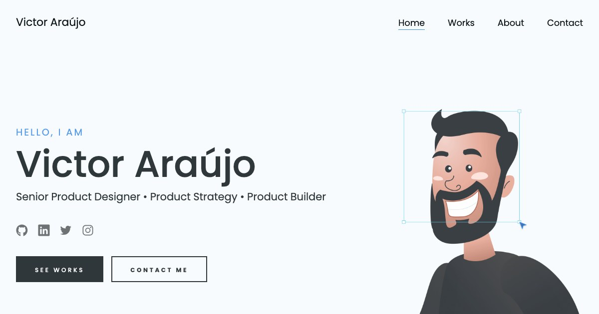

# Victor Araújo — Portfolio

Site pessoal de Victor Araújo, Senior Product Designer especializado em product strategy, UX/UI e branding.

🔗 [victor-araujo.com](https://victor-araujo.com)

## Sobre

Portfólio de página única com projetos de produto digital, pesquisa de usuário e identidade visual, além de uma página de detalhes para cada projeto.

## Stack

- HTML, CSS e JavaScript puro
- Formulário de contato via [PHPMailer](https://github.com/PHPMailer/PHPMailer)
- Hospedado no GitHub Pages, com deploy automático via GitHub Actions a cada push na `main`

## Estrutura

- `index.html` — página inicial (hero, works, about, contact)
- `project-detail.html` + `js/project-detail.js` — página de detalhes de cada projeto
- `css/` — estilos
- `js/` — scripts (menu, formulário, barra de skills, detalhes de projeto)
- `img/` — imagens e ícones
